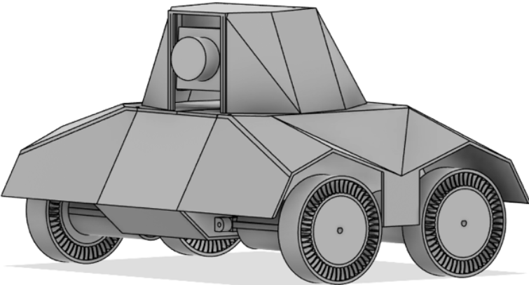

# TerraStride: An Autonomous Robot for Minimally Invasive Wildlife Monitoring



---

## About the Project 🌍

TerraStride is an autonomous robotic vehicle designed to overcome limitations in traditional wildlife monitoring technologies. By leveraging biomimetic design principles and cutting-edge AI, TerraStride enables minimally invasive, dynamic monitoring of wildlife behavior in natural habitats. It integrates advanced computer vision, low-light enhancement, and stealth technologies to reduce disruptions to animals while collecting high-quality data.

### Key Features 🌟

- **🦉 Non-invasive Monitoring**: Tracks and follows animals with minimal disturbance.
- **🤖 Advanced Computer Vision**: Utilizes YOLO and Hailo 8L accelerators for real-time object detection.
- **🌌 Low-Light Performance**: Employs biomimetic image enhancement inspired by nocturnal organisms.
- **🐾 Biomimetic Design**: Features cat-paw-inspired wheels and tortoise-shell camouflage for stealth.
- **📸 Dynamic Data Capture**: Stores high-quality images and videos, optimizing storage through confidence thresholds and motion triggers.

---

## Table of Contents 📑

- [About the Project 🌍](#about-the-project-🌍)
- [Getting Started 🚀](#getting-started-🚀)
- [Usage 🔧](#usage-🔧)
- [Acknowledgments 🙏](#acknowledgments-🙏)

---

## Getting Started 🚀

### Prerequisites 📋

Ensure the following tools and libraries are installed:

- Python 3.9 or later
- Hardware dependencies:
  - Arducam 5MP OV5647DS PTZ Camera 📷
  - Raspberry Pi 5 with Hailo 8L AI accelerator 🤖

### Installation 🛠️

1. **Clone the repository**:

   ```bash
   git clone https://github.com/UgurhanC/terrastride.git
   cd terrastride
   ```

2. **Set up the hardware**:

   - Attach the camera module, motors, and AI accelerator.
   - Follow the assembly instructions in the [hardware guide](3dmodel/build%20instructions.pdf).
   - As for logging into the Raspberry Pi, use the following credentials:
   - Username: terrastride
   - Password: raspberry

3. **Run the system**:

   ```bash
   ./run.sh
   ```

---

## Usage 🔧

To run the full TerraStride system, execute the following command:

```bash
./run.sh
```

This script handles all necessary setup and executes the required modules for the robot’s operation, including locomotion, tracking, and low-light enhancement.

---

## Acknowledgments 🙏

Special thanks to:

- **🎥 Ignas van Schaick** for insights on wildlife filmmaking.
- **📊 Dr. Emiel van Loon** for guidance on ecological tracking.
- **🌲 Dr. Richard Bischof** for expertise on stealth and ecological data collection.
- **💻 Professor Shaodi You** for contributions to real-time video processing.

This project was made possible by collaboration with ecological researchers, computer vision experts, and nature documentary filmmakers.
